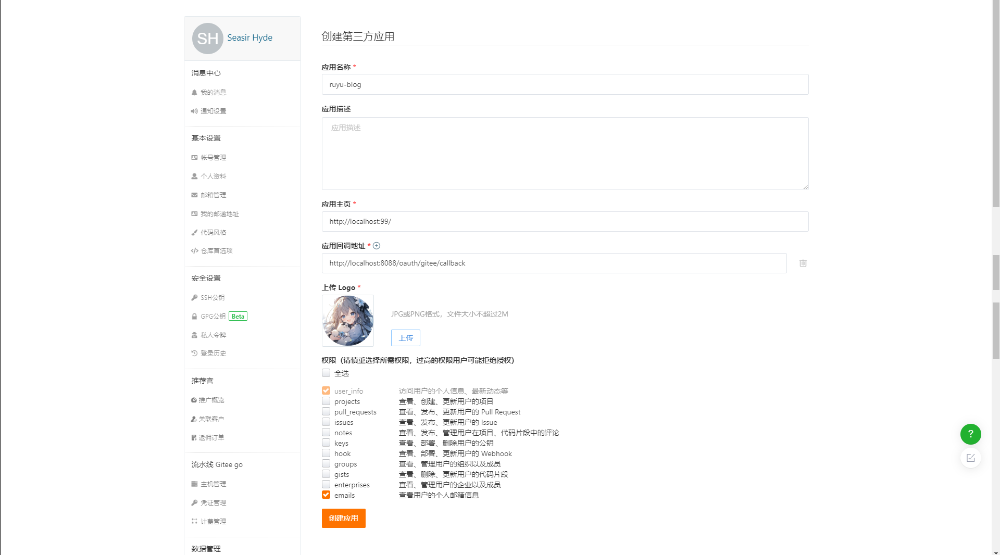

# Gitee

## 前言

:::info
随着数字化时代的快速发展，开发者们在创建和管理项目时，需要一个便捷、高效的平台来进行代码托管、版本控制和协作开发。Gitee 作为中国领先的代码托管平台，不仅为开发者提供了强大的功能，还支持丰富的第三方应用集成，进一步提升了开发体验和工作效率。

为了方便用户更加便捷地访问和管理 Gitee 上的资源，Gitee 提供了第三方应用登录功能。通过这一功能，用户可以使用现有的 Gitee 账号直接登录到各种第三方应用，无需重复注册或创建新账户。这不仅简化了登录流程，还保障了用户数据的统一性和安全性。

第三方应用登录的实现，为开发者提供了更为灵活和便捷的工具链，无论是在项目管理、代码审查、持续集成，还是在其他开发流程中，都能够与 Gitee 进行无缝对接。这种集成不仅简化了操作，还能够帮助开发者更好地聚焦于核心业务，提升工作效率。

我们希望通过这篇文档，能够帮助您了解 Gitee 第三方应用登录的基本原理、使用方法及其带来的诸多好处。让我们一起探索如何充分利用这一功能，打造更加高效、便捷的开发环境。
:::

## 1.进入设置

[设置 > 第三方应用] (https://gitee.com/oauth/applications)


## 2.创建应用
:::warning
记得生成密钥后保存，只有第一次可见！！！
:::
输入应用名称、应用主页、应用回调地址、上传logo和勾选emails


## 3.应用回调地址

```bash
http://[后端地址]:[端口]/oauth/gitee/callback
```